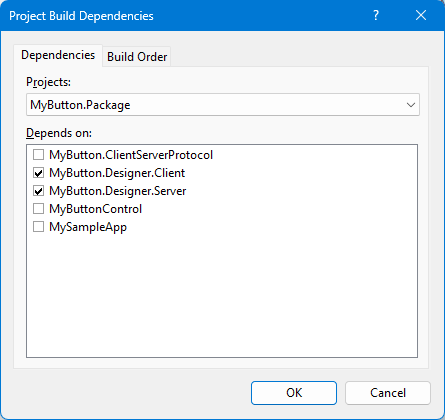
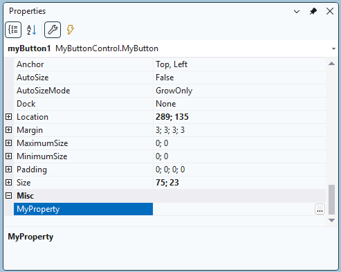

# Writing Custom Control in .NET 6


This repository contains a code sample originally published to CodeProject by a user "Stanko Milošev". 
The article can be found on [archive.org](https://web.archive.org/web/20230413100016/https://www.codeproject.com/Articles/5341387/Writing-Custom-Control-in-NET-6),
but the zip archive containing the sample is not restorable. So I rebuilt it using the description.

So, below is the original CodeProject description.

The sample code is found in directory [MyButtonDesignerTest](/CodeProjectSample/MyButtonDesignerTest). It uses .NET 9.0 and 
the package `Microsoft.WinForms.Designer.SDK` was upgraded to the most recent version `1.6.0`

I addition to the original text, I added a small sample app to the solution, see [The sample app](#the-sample-app)

*The following text is the original text converted to Markdown. So the .NET version and the package version don't match the current sample code.*

---


# Introduction
This is a short demonstration of creating custom button in .NET6 (Core). One property will be
added which will open an empty form, and write string "test" in the property field.

# Background
As [Klaus Löffelmann](https://devblogs.microsoft.com/dotnet/state-of-the-windows-forms-designer-for-net-applications/) stated, in .NET Core, 
new WinForms designer was introduced. I wrote this
article using [his example](https://github.com/KlausLoeffelmann/NetControlDesigners) since I could not find any other example, and most probably will be
changed in the future. This is my simplified example, mostly copy/pasted from [Klaus Löffelmann's
example](https://github.com/KlausLoeffelmann/NetControlDesigners).

# Using the Code
This example was made using Visual Studio 2022 and there will be four class library projects and
one Windows Control Library needed:
1. [MyButtonControl](#first-part---mybuttoncontrol) - Control implementation like properties, button inheritance
2. [MyButton.ClientServerProtocol](#second-part---mybuttonclientserverprotocol) - Windows Control Library, connection between client and
server, in both .NET 4.7 and 6
3. [MyButton.Designer.Server](#third-part---mybuttondesignerserver) - Smart tag implementation
4. [MyButton.Designer.Client](#fourth-part---mybuttondesignerclient) - Implementation of editor, behaviour of the property, and it is still
in .NET 4.7
5. [MyButton.Package](#fifth-part---mybuttonpackage) - Package of the control created, it has to be last builded

Install NuGet package [Microsoft.WinForms.Designer.SDK](https://www.nuget.org/packages/Microsoft.WinForms.Designer.SDK) for projects
MyButton.ClientServerProtocol, MyButton.Designer.Server and MyButton.Designer.Client:

```
Install-Package Microsoft.WinForms.Designer.SDK -Version 1.1.0-prerelease-preview3.22076.5
```

To debug attach to the process *DesignToolsServer.exe*. Sometimes, there is a need to clear NuGet
cache, especially when there is a change in the `MyButton.Designer.Client`, it can be done
specifically for this one project if you just delete the folder *C:\Users\userName\.nuget\packages\mybutton.package*.

To test the control, first add package source in NuGet as explained [here](https://docs.microsoft.com/en-us/nuget/consume-packages/install-use-packages-visual-studio#package-sources). 
Then install NuGet by first choosing package source from the dropdown list.

# First Part - MyButtonControl
1. Create a new .NET 6 class library project. Change `.csproj` to look like:
   ```xml
   <Project Sdk="Microsoft.NET.Sdk">
     <PropertyGroup>
       <TargetFramework>net6.0-windows</TargetFramework>
       <UseWindowsForms>true</UseWindowsForms>
     </PropertyGroup>
   </Project>
   ```
2. Add three files:
   * [MyButton.cs](#mybuttoncs)
   * [MyType.cs](#mytypecs)
   * [MyTypeConverter.cs](#mytypeconvertercs)

## MyButton.cs
   ```c#
   using System.ComponentModel;
   using System.Windows.Forms;
   
   namespace MyButtonControl
   {
     [Designer("MyButtonDesigner"), ComplexBindingProperties("DataSource")]
     public class MyButton : Button
     {
       public MyType MyProperty { get; set; }
     }
   }
   ```
   
## MyType.cs
   ```c#
   using System.ComponentModel;
   using System.Drawing.Design;
   
   namespace MyButtonControl
   {
     [TypeConverter(typeof(MyTypeConverter))]
     [Editor("MyButtonEditor", typeof(UITypeEditor))]
     public class MyType
     {
       public string AnotherMyProperty { get; set; }
       public MyType(string value)
       {
         AnotherMyProperty = value;
       }
     }
   }
   ```
   
## MyTypeConverter.cs
   ```c#
   using System;
   using System.ComponentModel;
   using System.Globalization;
   
   namespace MyButtonControl
   {
     internal class MyTypeConverter : TypeConverter
     {
       public override bool CanConvertTo (ITypeDescriptorContext context, Type destinationType)
       {
         return true;
       }
       public override bool CanConvertFrom(ITypeDescriptorContext context, Type sourceType)
       {
         return true;
       }
       public override object ConvertFrom(ITypeDescriptorContext context, CultureInfo culture, object value)
       {
         if (value is null)
         {
           return string.Empty;
         }
         return new MyType(value.ToString());
       }
       public override object ConvertTo(ITypeDescriptorContext context, CultureInfo culture, object value, Type destinationType)
       {
         return ((MyType)value)?.AnotherMyProperty;
       }
     }
   }
   ```
   
   
# Second Part - MyButton.ClientServerProtocol
1. Add new Windows Control Library, delete `UserControl1`, and change `.csproj` like:
   ```xml
   <Project Sdk="Microsoft.NET.Sdk">
     <PropertyGroup>
       <TargetFrameworks>net6.0-windows;net472</TargetFrameworks>
       <UseWindowsForms>true</UseWindowsForms>
       <LangVersion>9.0</LangVersion>
       <Nullable>enable</Nullable>
     </PropertyGroup>
   </Project>
   ```
   Save and reload the project in Visual Studio.

2. Install NuGet package [Microsoft.WinForms.Designer.SDK](https://www.nuget.org/packages/Microsoft.WinForms.Designer.SDK):
   ```
   Install-Package Microsoft.WinForms.Designer.SDK -Version 1.1.0-prerelease-preview3.22076.5
   ```
   
3. Add six files:
   * [AllowNullAttribute.cs](#allownullattributecs)
   * [EndpointNames.cs](#endpointnamescs)
   * [ViewModelNames.cs](#viewmodelnamescs)
   * [MyButtonViewModelRequest.cs](#mybuttonviewmodelrequestcs)
   * [MyButtonViewModelResponse.cs](#mybuttonviewmodelresponsecs)
   * [MyButtonViewModelEndpoint.cs](#mybuttonviewmodelendpointcs)

## AllowNullAttribute.cs
   ```c#
   #if NETFRAMEWORK
   namespace System.Diagnostics.CodeAnalysis
   {
     [System.AttributeUsage(System.AttributeTargets.Field | System.AttributeTargets.Parameter | System.AttributeTargets.Property, Inherited = false)]
     public class AllowNullAttribute : Attribute
     { }
   }
   #endif
   ```
   
## EndpointNames.cs
   ```c#
   namespace MyButton.ClientServerProtocol
   {
     public static class EndpointNames
     {
       public const string MyButtonViewModel = nameof(MyButtonViewModel);
     }
   }
   ```

## ViewModelNames.cs
   ```c#
   namespace MyButton.ClientServerProtocol
   {
     public static class ViewModelNames
     {
       public const string MyButtonViewModel = nameof(MyButtonViewModel);
     }
   }
   ```
   
## MyButtonViewModelRequest.cs
   ```c#
   using Microsoft.DotNet.DesignTools.Protocol.DataPipe;
   using Microsoft.DotNet.DesignTools.Protocol;
   using Microsoft.DotNet.DesignTools.Protocol.Endpoints;
   using System;
   
   namespace MyButton.ClientServerProtocol
   {
     public class MyButtonViewModelRequest : Request
     {
       public SessionId SessionId { get; private set; }
       public object? MyPropertyEditorProxy { get; private set; }
       public MyButtonViewModelRequest() { }
       public MyButtonViewModelRequest(SessionId sessionId, object? myProxy)
       {
         SessionId = sessionId.IsNull ?
           throw new ArgumentNullException(nameof(sessionId)) : sessionId;
           MyPropertyEditorProxy = myProxy;
       }
       public MyButtonViewModelRequest(IDataPipeReader reader) : base(reader) { }
       protected override void ReadProperties(IDataPipeReader reader)
       {
         SessionId = reader.ReadSessionId(nameof(SessionId));
         MyPropertyEditorProxy = reader.ReadObject(nameof(MyPropertyEditorProxy));
       }
       protected override void WriteProperties(IDataPipeWriter writer)
       {
         writer.Write(nameof(SessionId), SessionId);
         writer.WriteObject(nameof(MyPropertyEditorProxy), MyPropertyEditorProxy);
       }
     }
   }
   ```

## MyButtonViewModelResponse.cs
   ```c#
   using Microsoft.DotNet.DesignTools.Protocol.DataPipe;
   using Microsoft.DotNet.DesignTools.Protocol.Endpoints;
   using System;
   using System.Diagnostics.CodeAnalysis;
   
   namespace MyButton.ClientServerProtocol
   {
     public class MyButtonViewModelResponse : Response
     {
       [AllowNull]
       public object ViewModel { get; private set; }
       [AllowNull]
       public object MyProperty { get; private set; }
       public MyButtonViewModelResponse() { }
       public MyButtonViewModelResponse(object viewModel, object myProperty)
       {
         ViewModel = viewModel ?? throw new ArgumentNullException(nameof(viewModel));
         MyProperty = myProperty;
       }
       public MyButtonViewModelResponse(object viewModel)
       {
         ViewModel = viewModel ?? throw new ArgumentNullException(nameof(viewModel));
       }
       public MyButtonViewModelResponse(IDataPipeReader reader) : base(reader) { }
       protected override void ReadProperties(IDataPipeReader reader)
       {
         ViewModel = reader.ReadObject(nameof(ViewModel));
       }
       protected override void WriteProperties(IDataPipeWriter writer)
       {
         writer.WriteObject(nameof(ViewModel), ViewModel);
         writer.WriteObject(nameof(MyProperty), MyProperty);
       }
     }
   }
   ```
   
## MyButtonViewModelEndpoint.cs
   ```c#
   using System.Composition;
   using Microsoft.DotNet.DesignTools.Protocol.DataPipe;
   using Microsoft.DotNet.DesignTools.Protocol.Endpoints;
   
   namespace MyButton.ClientServerProtocol
   {
     [Shared]
     [ExportEndpoint]
     public class MyButtonViewModelEndpoint :
     Endpoint<MyButtonViewModelRequest, MyButtonViewModelResponse>
     {
       public override string Name => EndpointNames.MyButtonViewModel;
       protected override MyButtonViewModelRequest
       CreateRequest(IDataPipeReader reader) => new(reader);
       protected override MyButtonViewModelResponse CreateResponse(IDataPipeReader reader) => new(reader);
     }
   }
   ```
   
   
# Third Part - MyButton.Designer.Server
1. Create a new .NET 6 class library project. Change .csproj to look like:
   ```xml
   <Project Sdk="Microsoft.NET.Sdk">
     <PropertyGroup>
       <TargetFramework>net6.0-windows</TargetFramework>
       <UseWindowsForms>true</UseWindowsForms>
     </PropertyGroup>
   </Project>
   ```

2. Install NuGet package [Microsoft.WinForms.Designer.SDK](https://www.nuget.org/packages/Microsoft.WinForms.Designer.SDK):
   ```
   Install-Package Microsoft.WinForms.Designer.SDK -Version 1.1.0-prerelease-preview3.22076.5
   ```
   
3. Add six files:
   * [MyButtonDesigner.cs](#mybuttondesignercs)
   * [MyButtonViewModel.cs](#mybuttonviewmodelcs)
   * [MyButton.ActionList.cs](#mybuttonactionlistcs)
   * [MyButtonViewModelHandler.cs](#mybuttonviewmodelhandlercs)
   * [MyButtonViewModel.Factory.cs](#mybuttonviewmodelfactorycs)
   * [TypeRoutingProvider.cs](#typeroutingprovidercs)

## MyButtonDesigner.cs
   ```c#
   using Microsoft.DotNet.DesignTools.Designers;
   using Microsoft.DotNet.DesignTools.Designers.Actions;
   
   namespace MyButton.Designer.Server
   {
     internal partial class MyButtonDesigner : ControlDesigner
     {
       public override DesignerActionListCollection ActionLists 
         => new()
         {
           new ActionList(this)
         };
     }
   }
   ```
## MyButtonViewModel.cs
   ```c#
   using Microsoft.DotNet.DesignTools.ViewModels;
   using System;
   using System.Diagnostics.CodeAnalysis;
   using MyButton.ClientServerProtocol;
   using MyButtonControl;
   
   namespace MyButton.Designer.Server
   {
     internal partial class MyButtonViewModel : ViewModel
     {
       public MyButtonViewModel(IServiceProvider provider) : base(provider)
       {
       }
       public MyButtonViewModelResponse Initialize(object myProperty)
       {
         MyProperty = new MyType(myProperty.ToString());
         return new MyButtonViewModelResponse(this, MyProperty);
       }
       [AllowNull]
       public MyType MyProperty { get; set; }
     }
   }
   ```
   
## MyButton.ActionList.cs
   ```c#
   using Microsoft.DotNet.DesignTools.Designers.Actions;
   using System.ComponentModel;
   using MyButtonControl;
   
   namespace MyButton.Designer.Server
   {
     internal partial class MyButtonDesigner
     {
       private class ActionList : DesignerActionList
       {
         private const string Behavior = nameof(Behavior);
         private const string Data = nameof(Data);
         public ActionList(MyButtonDesigner designer) : base(designer.Component)
         {
         }
         public MyType MyProperty
         {
           get => ((MyButtonControl.MyButton)Component!).MyProperty;
           set => TypeDescriptor.GetProperties(Component!)[nameof(MyProperty)]!.SetValue(Component, value);
         }
         public override DesignerActionItemCollection GetSortedActionItems()
         {
           DesignerActionItemCollection actionItems = new()
           {
             new DesignerActionHeaderItem(Behavior),
             new DesignerActionHeaderItem(Data),
             new DesignerActionPropertyItem(
               nameof(MyProperty),
               "Empty form",
               Behavior,
               "Display empty form.")
           };
           return actionItems;
         }
       }
     }
   }
   ```

## MyButtonViewModelHandler.cs
   ```c#
   using Microsoft.DotNet.DesignTools.Protocol.Endpoints;
   using MyButton.ClientServerProtocol;
   
   namespace MyButton.Designer.Server
   {
     [ExportRequestHandler(EndpointNames.MyButtonViewModel)]
     public class MyButtonViewModelHandler : RequestHandler<MyButtonViewModelRequest, MyButtonViewModelResponse>
     {
       public override MyButtonViewModelResponse HandleRequest(MyButtonViewModelRequest request)
       {
         var designerHost = GetDesignerHost(request.SessionId);
         var viewModel = CreateViewModel<MyButtonViewModel>(designerHost);
         return viewModel.Initialize(request.MyPropertyEditorProxy!);
       }
     }
   }
   ```

## MyButtonViewModel.Factory.cs
   ```c#
   using Microsoft.DotNet.DesignTools.ViewModels;
   using System;
   using MyButton.ClientServerProtocol;
   
   namespace MyButton.Designer.Server
   {
     internal partial class MyButtonViewModel
     {
       [ExportViewModelFactory(ViewModelNames.MyButtonViewModel)]
       private class Factory : ViewModelFactory<MyButtonViewModel>
       {
         protected override MyButtonViewModel CreateViewModel(IServiceProvider provider)
           => new(provider);
       }
     }
   }
   ```

## TypeRoutingProvider.cs
   ```c#
   using Microsoft.DotNet.DesignTools.TypeRouting;
   using System.Collections.Generic;
   
   namespace MyButton.Designer.Server
   {
     [ExportTypeRoutingDefinitionProvider]
     internal class TypeRoutingProvider : TypeRoutingDefinitionProvider
     {
       public override IEnumerable<TypeRoutingDefinition> GetDefinitions()
         => new[]
         {
           new TypeRoutingDefinition(
             TypeRoutingKinds.Designer,
             nameof(MyButtonDesigner),
            typeof(MyButtonDesigner))
         };
     }
   }
   ```

## Fourth Part - MyButton.Designer.Client
1. Create a new .NET 6 class library project. Change `.csproj` to look like:

   ```xml
   <Project Sdk="Microsoft.NET.Sdk.WindowsDesktop">
     <PropertyGroup>
       <TargetFramework>net472</TargetFramework>
       <UseWindowsForms>true</UseWindowsForms>
       <LangVersion>9.0</LangVersion>
     </PropertyGroup>
   </Project>
   ```
   
2. Install NuGet package [Microsoft.WinForms.Designer.SDK](https://www.nuget.org/packages/Microsoft.WinForms.Designer.SDK):
   ```
   Install-Package Microsoft.WinForms.Designer.SDK -Version 1.1.0-prerelease-preview3.22076.5
   ```
   
3. Add three files:
   * [MyButtonViewModel.cs](#mybuttonviewmodelcs_client)
   * [MyButtonEditor.cs](#mybuttoneditorcs)
   * [TypeRoutingProvider.cs](#typeroutingprovidercs_client)

## MyButtonViewModel.cs
<a name="mybuttonviewmodelcs_client" />
   ```c#
   using System;
   using Microsoft.DotNet.DesignTools.Client.Proxies;
   using Microsoft.DotNet.DesignTools.Client;
   using Microsoft.DotNet.DesignTools.Client.Views;
   using MyButton.ClientServerProtocol;
   
   namespace MyButton.Designer.Client
   {
     internal partial class MyButtonViewModel : ViewModelClient
     {
       [ExportViewModelClientFactory(ViewModelNames.MyButtonViewModel)]
       private class Factory : ViewModelClientFactory<MyButtonViewModel>
       {
         protected override MyButtonViewModel CreateViewModelClient(ObjectProxy? viewModel)
           => new(viewModel);
       }
       private MyButtonViewModel(ObjectProxy? viewModel) : base(viewModel)
       {
         if (viewModel is null)
         {
           throw new NullReferenceException(nameof(viewModel));
         }
       }
       public static MyButtonViewModel Create(IServiceProvider provider, object? templateAssignmentProxy)
       {
         var session = provider.GetRequiredService<DesignerSession>();
         var client = provider.GetRequiredService<IDesignToolsClient>();
         var createViewModelEndpointSender = client.Protocol.GetEndpoint<MyButtonViewModelEndpoint>().GetSender(client);
         var response = createViewModelEndpointSender.SendRequest(new MyButtonViewModelRequest(session.Id, templateAssignmentProxy));
         var viewModel = (ObjectProxy)response.ViewModel!;
         var clientViewModel = provider.CreateViewModelClient<MyButtonViewModel>(viewModel);
         return clientViewModel;
       }
       public object? MyProperty
       {
         get => ViewModelProxy?.GetPropertyValue(nameof(MyProperty));
         set => ViewModelProxy?.SetPropertyValue(nameof(MyProperty), value);
       }
     }
   }
   ```
   
## MyButtonEditor.cs
   ```c#
   using System;
   using System.ComponentModel;
   using System.Drawing.Design;
   using System.Windows.Forms;
   using System.Windows.Forms.Design;
   
   namespace MyButton.Designer.Client
   {
     public class MyButtonEditor : UITypeEditor
     {
       public override UITypeEditorEditStyle GetEditStyle(ITypeDescriptorContext context)
         => UITypeEditorEditStyle.Modal;
       public override object? EditValue(ITypeDescriptorContext context, IServiceProvider provider, object? value)
       {
         if (provider is null)
         {
           return value;
         }
         
         Form myTestForm;
         myTestForm = new Form();
         var editorService = provider.GetRequiredService<IWindowsFormsEditorService>();
         editorService.ShowDialog(myTestForm);
         
         MyButtonViewModel viewModelClient = MyButtonViewModel.Create(provider, "test");
         return viewModelClient.MyProperty;
       }
     }
   }
   ```
## TypeRoutingProvider.cs
<a name="typeroutingprovidercs_client" />
   ```c#
   using Microsoft.DotNet.DesignTools.Client.TypeRouting;
   using System.Collections.Generic;
   
   namespace MyButton.Designer.Client
   {
     [ExportTypeRoutingDefinitionProvider]
     internal class TypeRoutingProvider : TypeRoutingDefinitionProvider
     {
       public override IEnumerable<TypeRoutingDefinition> GetDefinitions()
       {
         return new[]
         {
           new TypeRoutingDefinition(
             TypeRoutingKinds.Editor,
             nameof(MyButtonEditor),
             typeof(MyButtonEditor)
           )
         };
       }
     }
   }
   ```
   
# Fifth Part - MyButton.Package
1. Create a new .NET 6 class library project, delete `Class1.cs`. Change `.csproj` to look like:
   ```xml
   <Project Sdk="Microsoft.NET.Sdk">
     <PropertyGroup>
       <TargetFramework>net6.0</TargetFramework>
       <IncludeBuildOutput>false</IncludeBuildOutput>
       <ProduceReferenceAssembly>false</ProduceReferenceAssembly>
       <GeneratePackageOnBuild>true</GeneratePackageOnBuild>
       <TargetsForTfmSpecificContentInPackage>$(TargetsForTfmSpecificContentInPackage);_GetFilesToPackage</TargetsForTfmSpecificContentInPackage>
       <RunPostBuildEvent>Always</RunPostBuildEvent>
     </PropertyGroup>
     <Target Name="_GetFilesToPackage">
       <ItemGroup>
         <_File Include="$(SolutionDir)\MyButtonControl\bin\$(Configuration)\net6.0-windows\MyButtonControl.dll"/>
         <_File Include="$(SolutionDir)\MyButton.Designer.Client\bin\$(Configuration)\net472\MyButton.Designer.Client.dll" 
                TargetDir="Design/WinForms"/>
         <_File Include="$(SolutionDir)\MyButton.Designer.Server\bin\$(Configuration)\net6.0-windows\MyButton.Designer.Server.dll" 
                TargetDir="Design/WinForms/Server"/>
         <_File Include="$(SolutionDir)\MyButton.ClientServerProtocol\bin\$(Configuration)\net472\MyButton.ClientServerProtocol.dll" 
                TargetDir="Design/WinForms" />
         <_File Include="$(SolutionDir)\MyButton.ClientServerProtocol\bin\$(Configuration)\net6.0-windows\MyButton.ClientServerProtocol.dll" 
                TargetDir="Design/WinForms/Server" />
       </ItemGroup>
       <ItemGroup>
         <TfmSpecificPackageFile Include="@(_File)" 
                                 PackagePath="$(BuildOutputTargetFolder)/$(TargetFramework)/%(_File.TargetDir)"/>
       </ItemGroup>
     </Target>
   </Project>
   ```
   
# Points of Interest
Please notice that [MyButton.Package](#fifth-part-my-button-package) has to be builded last.

So, add this dependency to the project:



---


# The sample app

In the original article, a sample app was not described. Maybe it was part of the now inaccessible sample code.

So, add a new "Windows Forms App" project targeting .NET 6.0 to the solution.

This project has to reference the Nuget package created from project [MyButton.Package](#fifth-part-my-button-package).
So, first add a file "Nuget.config" to the root of the solution:

```xml
<?xml version="1.0" encoding="utf-8"?>
<configuration>
  <packageSources>
    <add key="local" value=".\MyButton.Package\bin\Debug\" />
  </packageSources>
</configuration>
```

Then add a package reference to the `.csproj` file:

```xml
<Project Sdk="Microsoft.NET.Sdk">

  <PropertyGroup>
    <OutputType>WinExe</OutputType>
    <TargetFramework>net9.0-windows</TargetFramework>
    <Nullable>enable</Nullable>
    <UseWindowsForms>true</UseWindowsForms>
    <ImplicitUsings>enable</ImplicitUsings>
  </PropertyGroup>

  <ItemGroup>
    <PackageReference Include="MyButton.Package" Version="1.0.0" />
  </ItemGroup>

</Project>
```

Just for completeness, I added project dependency on the `MyButton.Package` project, see above.

Visual Studio will now resolve the Package from the build output of the `MyButton.Package` project.


Now, add a control `MyButton` to the Form. In the properties grid, you will find a property `MyProperty`, and when clicking
the ellipsis button, a blank form will be shown:



## Pitfalls:
* If you first open the solution, Visual Studio will report a package manager error because it cannot resolve the package `MyButton.Package`:

  `Unable to find package MyButton.Package. No packages exist with this id in source(s): ComponentOne Local, local, Microsoft Visual Studio Offline Packages, nuget.org`

  So, first build the `MyButton.Package` project, then close and reopen the solution.
* If you make changes to any of the projects in this solution and rebuilt it, you have to increment the package version and
the package reference version in the sample project. It should also work to delete the package manager cache (directory `%USERPROFILE%\.nuget\packages\mybutton.package`) 
after having built the `MyButton.Package` so that Visual Studio pulls the modified version.