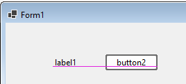
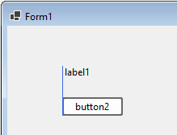

# SnapLines

This directory contains a series of samples about the handling of snaplines in the WinForms Out-of-process designer.

Snaplines are blue (or purple) lines drawn when dragging a control near another control, and they allow aligning controls on one line.

A baseline is useful to bring the height of text of controls to the same y position:

Left/Right/Top/Bottom baselines are used to align the edges of controls:

## The samples
* The first sample [SnapLineDesignerBasics](SnapLineDesignerBasics/README.md) demonstrates how to add custom snaplines to a control.

