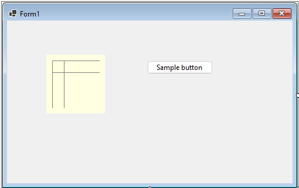
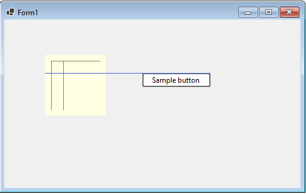
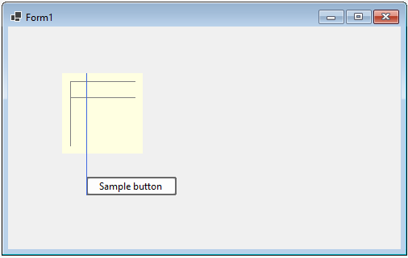

# SnapLines, part 1

This is the first part of a series of samples about the handling of snaplines in the WinForms Out-of-process designer.

This project demonstrates how to add custom snaplines to a control.

# Overview

This sample is built upon a custom control `MyPanel` that is simply a subclass of `System.Windows.Forms.UserControl`
which draws some lines. Those lines don't have a meaning, they just reflect the position of the snap lines. 

The sample form looks like this (the yellow box is the user control `MyPanel`):




At design time, if you move the buttons around, snaplines will be rendered according to the lines in `MyPanel`:



The vertical lines will also create snaplines:



# The solution structure

First you should read the [full designer sample with custom properties](../../CodeProjectSample/README.md) to understand the project
structure and the Nuget package handling. But our approach is simpler, we don't need the .NET 4.8 "Client" project, and thus the "Protocol" project
is also not necessary.

My sample consists of three projects:
* SnapLineBasics.Control: this library contains a custom control `MyPanel`.
* SnapLineBasics.Designer.Server: the WinForms designer project (server side). It contains the design server implementation.
* SnapLineBasics.Package: creates a Nuget Package containing the `SnapLineBasics.Control` and `SnapLineBasics.Designer.Server` dlls.

There is also a sample app project `MySampleApp` which references the user control.

# Project "SnapLineBasics.Control"

The full code of `MyPanel` is this:

```c#
[Designer("SnapLineBasics.Designer.Server.MyPanelDesigner")]
public class MyPanel : UserControl
{

  protected override void OnPaint(PaintEventArgs e)
  {
    base.OnPaint(e);

    //Horizontal:
    e.Graphics.DrawLine (Pens.Gray, 10, 10, this.Width - 10, 10);
    e.Graphics.DrawLine(Pens.Gray, 10, 30, this.Width - 10, 30);

    //Vertical:
    e.Graphics.DrawLine(Pens.Gray, 10, 10, 10, this.Height - 10);
    e.Graphics.DrawLine(Pens.Gray, 30, 10, 30, this.Height - 10);
  }
}
```

Four lines are drawn starting at fixed top/left positions, the right/bottom end is dynamically calculated based on the control size.

Note the `Designer` attribte.


# Project "SnapLineBasics.Designer.Server"

It contains only a designer implementation:

```c#
internal partial class MyPanelDesigner : ControlDesigner
{
  public override IList<SnapLine> SnapLines
  {
    get
    {
      IList<SnapLine> snapLines = base.SnapLines;

      snapLines.Add(new SnapLine(SnapLineType.Top, 10));
      snapLines.Add(new SnapLine(SnapLineType.Bottom, 10));
      snapLines.Add(new SnapLine(SnapLineType.Top, 30));
      snapLines.Add(new SnapLine(SnapLineType.Bottom, 30));

      snapLines.Add(new SnapLine(SnapLineType.Left, 10));
      snapLines.Add(new SnapLine(SnapLineType.Right, 10));
      snapLines.Add(new SnapLine(SnapLineType.Left, 30));
      snapLines.Add(new SnapLine(SnapLineType.Right, 30));

      return snapLines;
    }
  }
}
```

The designer is a subclass of `Microsoft.DotNet.DesignTools.Designers.ControlDesigner`. It overrides  the property `SnapLines` and
first calls the base class properties (which adds the default snaplines for the outer edges of the control).

Then it adds four snaplines matching the lines drawn inside the `MyPanel` user control: the offset argument is the 
offset to the top edge of the control for `SnapLineType.Top` and `SnapLineType.Bottom`, and the offset to the left edge
for `Left` and `Right`.

Note that each snap line is added twice, once with `SnapLineType.Top` and another time with `SnapLineType.Bottom`. Reason:
if you only add `SnapLineType.Top`, the snap lines are only drawn when the top edge of the button is near the snap line.
But if you move the bottom edge of the button near near a snap line position, nothing will happen.
In my use case, I consider it useful that the horizontal snaplines are visible for button and top edge of the button,
so I added both types of snap line.

**Why not using `SnapLineType.Horizontal`?**

This type did not work for me. It has a special meaning and seems to be some kind of inner offset.

# Project "SnapLineBasics.Package"

This project creates the Nuget Package containing the files `SnapLineBasics.Control.dll` and `SnapLineBasics.Designer.Server.dll`.

In "Nuget.config" of the solution, I defined the "bin\Debug" directory as package source for the sample app.

# Building the sample

This is a bit tricky. When you first open the sample, there will be a Nuget error that package "SnapLineBasics.Package" cannot be resolved.
So first built the project "SnapLineBasics.Package", then build the project "MySampleApp".

If you make modifications to code in either "SnapLineBasics.Control" or "SnapLineBasics.Designer.Server", it is a bit more tricky:

* Build the project "SnapLineBasics.Package" 
* close open designer of "Form1" in project "MySampleApp".
* check in task manager that no process "DesignToolsServer.exe" is running. If you find one, kill it.
* In your local nuget cache, kill the directory "%USERPROFILE%\.nuget\packages\snaplinebasics.package\1.0.0"
* Build the project "MySampleApp". You might also check that the Nuget cache now contains recent versions of "SnapLineBasics.Control.dll" 
(in "lib\net9.0\") and "SnapLineBasics.Designer.Server.dll" (in "lib\net9.0\Design\WinForms\Server")

Now you can open "Form1.cs" again in designer.