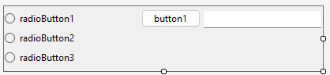
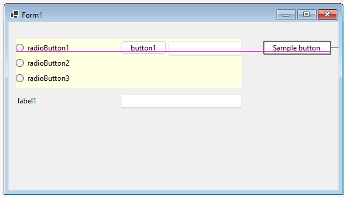
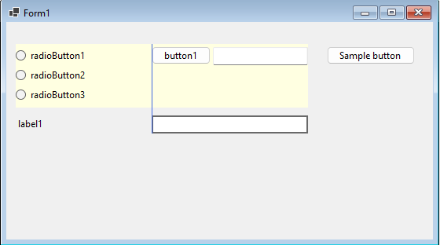

# SnapLines, part 2

This is the second part of a series of samples about the handling of snaplines in the WinForms Out-of-process designer.

See [part 1](../SnapLineDesignerBasics/README.md) for the basic concepts.


This project demonstrates how to copy snaplines from a child control of a `UserControl`.

# Overview

In my real world application, I sometimes create a `System.Windows.Forms.UserControl` with some controls on it 
(e.g. labels and textboxes)
When placing this `UserControl` on form, I might want to align other controls in a way that e.g. their left edge
matches the one of a control on my `UserControl`.


This sample contains a class `MyUserControl` with this content:



When using this control on a form (in the screenshot, `MyUserControl` has a yellow background to show where it is), 
I might want to add a control to the right of it, and this controls should have the same baseline as
the first line of controls in the `UserControl`:



Or a control should be aligned the the left edge of an inner control:



This sample shows how you can copy the snap lines of child controls of `MyUserControl` and shown them on the owner form.

# The solution structure

First you should read the [full designer sample with custom properties](../../CodeProjectSample/README.md) to understand the project
structure and the Nuget package handling. But our approach is simpler, we don't need the .NET 4.8 "Client" project, and thus the "Protocol" project
is also not necessary.

My sample consists of three projects:
* SnapLineFromChild.Control: this library contains a custom user control `MyUserControl`.
* SnapLineFromChild.Designer.Server: the WinForms designer project (server side). It contains the design server implementation.
* SnapLineFromChild.Package: creates a Nuget Package containing the `SnapLineFromChild.Control` and `SnapLineFromChild.Designer.Server` dlls.

There is also a sample app project `MySampleApp` which references the user control.

# Project "SnapLineFromChild.Control"

The full code of `MyUserControl` is this:

```c#
[Designer("SnapLineFromChild.Designer.Server.SnapLineFromChildDesigner")]
public partial class MyUserControl : UserControl
{
  public MyUserControl()
  {
    InitializeComponent();
  }

  internal RadioButton RadioButton1 => this.radioButton1;
  internal RadioButton RadioButton2 => this.radioButton2;
  internal RadioButton RadioButton3 => this.radioButton3;
  internal Button Button => this.button1;
  internal TextBox TextBox => this.textBox1;
}
```

Note the `Designer` attribte.

The designer also needs access to all child controls that shall produce snaplines. So I added properties for all those controls.

There is one technical detail: I declared the properties for all child controls as `internal` instead of public, because
I don't want to make them available to a consumer of this control (e.g. the sample form), because this consumer could manipulate the child
controls directly and thus break the UserControl itself.

Of course, the designer server dll now cannot access those properties. But you can declare that the designer server dll
can read/write internal API anyway. This is done in `SnapLineFromChild.Control.csproj` by adding an `AssemblyAttribute` definition:


```xml
<Project Sdk="Microsoft.NET.Sdk">
  ...
  <ItemGroup>
    <AssemblyAttribute Include="System.Runtime.CompilerServices.InternalsVisibleToAttribute">
      <_Parameter1>SnapLineFromChild.Designer.Server</_Parameter1>
      <_Parameter1_TypeName>System.String</_Parameter1_TypeName>
    </AssemblyAttribute>
  </ItemGroup>
</Project>
```

If we had a `AssemblyInfo.cs` file, it could be defined like this:

```c#
[assembly: System.Runtime.CompilerServices.InternalsVisibleToAttribute("SnapLineFromChild.Designer.Server")]
```

# Project "SnapLineFromChild.Designer.Server"

It contains only a designer implementation:

```c#
internal partial class SnapLineFromChildDesigner : ControlDesigner
{
  public override IList<SnapLine> SnapLines
  {
    get
    {
      IList<SnapLine> snapLines = base.SnapLines;

      MyUserControl userControl = (MyUserControl)this.Control;
      
      try
      {
        //Copy snaplines from child controls
        //...
      }
      catch (Exception ex)
      {
        this.DisplayError(ex.ToString());
      }

      return snapLines;
    }
  }
}
```

The tricky part is found in the `try`/`catch` block and will be described below. I added the `try`/`catch` block because exceptions in custom designers might not be reported by Visual Studio
and thus you might wonder why nothing seems to happen, but actually the designer is broken. Note that `DisplayError` contains also an override
that accepts an `Exception`, but this method shows only the message. I prefer showing the stack trace if possible, so I called `ex.ToString()`.

**Copying snaplines from a single child control:**

The following code copies the `Baseline` snapline of the `RadioButton1` child control:

```c#
IDesigner designer = TypeDescriptor.CreateDesigner(userControl.RadioButton1, typeof(IDesigner));
if (designer == null)
{
  throw new InvalidOperationException($"Could not create a Designer for ChildControl {userControl.RadioButton1}.");
}


designer.Initialize(userControl.RadioButton1);

IList<SnapLine> snapLinesChild = CopySnapLines(designer);

foreach (SnapLine snapLine in snapLinesChild)
{
  if (snapLine.SnapLineType == SnapLineType.Baseline)
  {
    int offset = snapLine.Offset + userControl.RadioButton1.Location.Y;
    SnapLine snapLineNew = new SnapLine(snapLine.SnapLineType, offset, snapLine.Filter, snapLine.Priority);
    snapLines.Add(snapLineNew);
  }
}

```

* First, a `IDesigner` is created with a call to `TypeDescriptor.CreateDesigner`.
* This designer is initialized for the child control.
* Now the tricky part: I first thought I could to something like this:

  ```c#
  ControlDesigner controlDesigner = (ControlDesigner)designer;
  IList<SnapLine> snapLinesChild2 = controlDesigner.SnapLines;
  ```
  
  But this fails:
  ```
  System.InvalidCastException: 'Unable to cast object of type 'System.Windows.Forms.Design.RadioButtonDesigner' to type 'Microsoft.DotNet.DesignTools.Designers.ControlDesigner'.'
  ```
  
  As you might see from the error message, the radio button designer is probably following the old approach.
  
  Next approach: we use reflection to fetch the property `SnapLines`, get the value and cast it to a `IList<SnapLine>`:
  
  ```c#
  PropertyInfo propSnapLines = designer.GetType().GetProperty("SnapLines", BindingFlags.Instance | BindingFlags.Public);
  IList<SnapLine> snapLinesChild2 = (IList<SnapLine>)propSnapLines.GetValue(designer);
  ```
  
  This also fails: 
  ```
  System.InvalidCastException: 'Unable to cast object of type 'System.Collections.Generic.List`1[System.Windows.Forms.Design.Behavior.SnapLine]' 
    to type 'System.Collections.Generic.IList`1[Microsoft.DotNet.DesignTools.Designers.Behaviors.SnapLine]'.'
  ```

  As you can see in the error message, two different `SnapLine` classes exist in different namespaces/assemblies. To resolve this,
  we have to convert the `System.Windows.Forms.Design.Behavior.SnapLine` class to the `Microsoft.DotNet.DesignTools.Designers.Behaviors.SnapLine` version.
  Fortunately, they have identical properties, so we can copy the property values.
  
  This is done in a helper method `CopySnapLines`
  
  ```c#
  private static List<SnapLine> CopySnapLines(IDesigner _designer)
  {
    PropertyInfo propSnaplInes = _designer.GetType().GetProperty("SnapLines", BindingFlags.Instance | BindingFlags.Public);
    object objSnapLines = propSnaplInes.GetValue(_designer);
    IList listSnapLines = (IList)objSnapLines;

    List<SnapLine> listSnapLinesNew = new List<SnapLine>();
    foreach (object line in listSnapLines)
    {
      PropertyInfo propInfoType = line.GetType().GetProperty("SnapLineType", BindingFlags.Instance | BindingFlags.Public);
      object objType = propInfoType.GetValue(line);
      SnapLineType snapLineType = Enum.Parse<SnapLineType>(objType.ToString());

      PropertyInfo propInfoOffset = line.GetType().GetProperty("Offset", BindingFlags.Instance | BindingFlags.Public);
      int offset = (int)propInfoOffset.GetValue(line);

      PropertyInfo propInfoPriority = line.GetType().GetProperty("Priority", BindingFlags.Instance | BindingFlags.Public);
      object objPrioriy = propInfoPriority.GetValue(line);
      //Convert to Enum to String and back and convert it this way:
      SnapLinePriority snapLinePriority = Enum.Parse<SnapLinePriority>(objPrioriy.ToString());

      listSnapLinesNew.Add(new SnapLine(snapLineType, offset, snapLinePriority));
    }

    return listSnapLinesNew;
  }
  ```
* Now we have a list of snaplines of the child control and can filter them. In the sample snippet, only the `Baseline` is copied:
  ```c#
  foreach (SnapLine snapLine in snapLinesChild)
  {
    if (snapLine.SnapLineType == SnapLineType.Baseline)
    {
      //Copy snapline
    }
  }
  ```
* Final step: the baseline offset is relative inside the child control. We have to convert it to parent coordinates. For the baseline, this is the y location.
  ```c#
  int offset = snapLine.Offset + userControl.RadioButton2.Location.Y;
  SnapLine snapLineNew = new SnapLine(snapLine.SnapLineType, offset, snapLine.Filter, snapLine.Priority);
  ```

The same step is done for 
* the baselines of the other two radio buttons
* the left line of the button (which results in two snaplines with `SnapLineType.Left` and`SnapLineType.Right`  and the same offset, see the 
explanation in the previous sample).
* the left line of the textbox

This is a lot of work - the next sample will show a more elegant way to reuse child control snaplines.

# Project "SnapLineFromChild.Package"

This project creates the Nuget Package containing the files `SnapLineFromChild.Control.dll` and `SnapLineFromChild.Designer.Server.dll`.

In "Nuget.config" of the solution, I defined the "bin\Debug" directory as package source for the sample app.

# Building the sample

This is a bit tricky. When you first open the sample, there will be a Nuget error that package "SnapLineFromChild.Package" cannot be resolved.
So first built the project "SnapLineFromChild.Package", then build the project "MySampleApp".

If you make modifications to code in either "SnapLineFromChild.Control" or "SnapLineFromChild.Designer.Server", it is a bit more tricky:

* Build the project "SnapLineFromChild.Package" 
* close open designer of "Form1" in project "MySampleApp".
* check in task manager that no process "DesignToolsServer.exe" is running. If you find one, kill it.
* In your local nuget cache, kill the directory "%USERPROFILE%\.nuget\packages\snaplinefromchild.package\1.0.0"
* Build the project "MySampleApp". You might also check that the Nuget cache now contains recent versions of "SnapLineFromChild.Control.dll" 
(in "lib\net9.0\") and "SnapLineFromChild.Designer.Server.dll" (in "lib\net9.0\Design\WinForms\Server")

Now you can open "Form1.cs" again in designer.